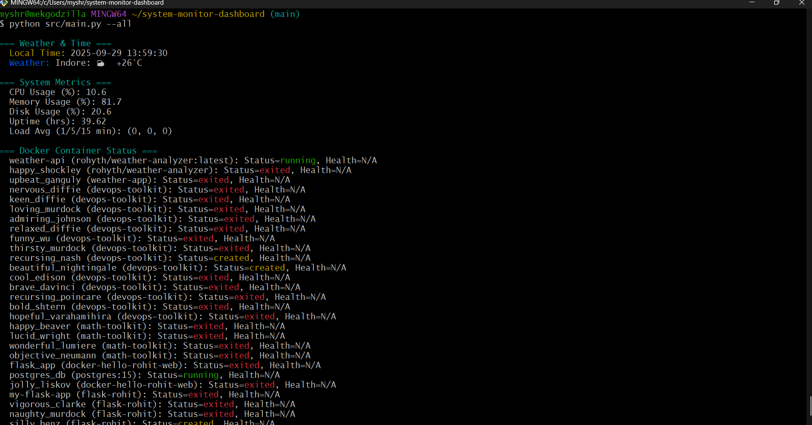

# 🧠 System Monitor Dashboard

Modular CLI dashboard for real-time system metrics, Docker container health, and weather updates — built for DevOps workflows and recruiter-ready portfolios.

---

## 📸 Demo

  
*Color-coded CLI output with system stats, weather, and Docker health*
---

## ⚙️ Features

- CPU, memory, disk, and uptime stats
- Docker container health checks
- Weather + time widget
- Modular CLI flags (`--weather`, `--metrics`, `--docker`, `--all`)
- Color-coded terminal output
- Cross-platform (Windows/Linux) compatibility

---

## 🚀 Setup

```bash
git clone https://github.com/myshra777-ai/system-monitor-dashboard.git
cd system-monitor-dashboard
pip install -r requirements.txt
python src/main.py --all
